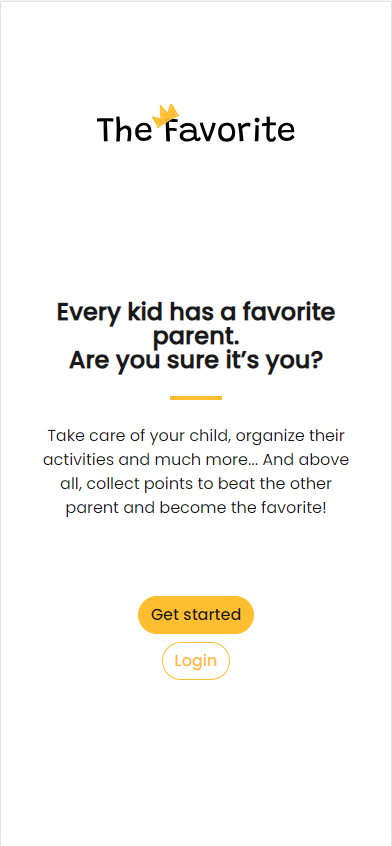
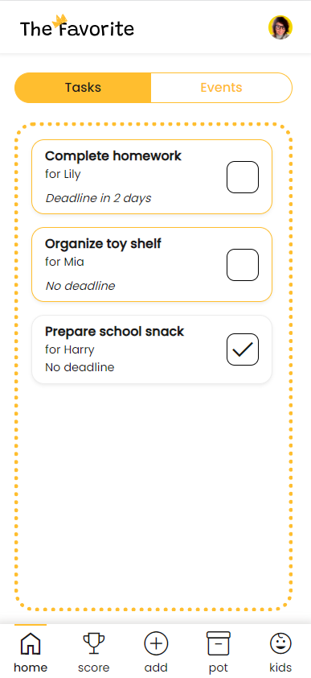
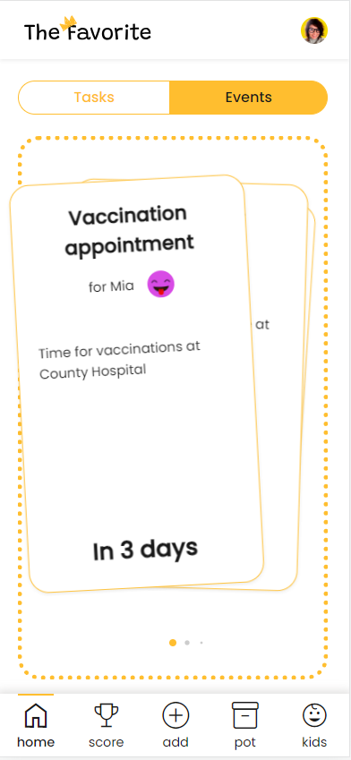
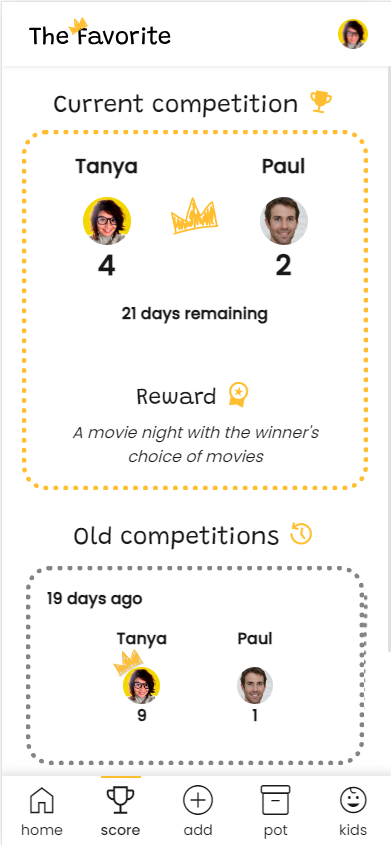
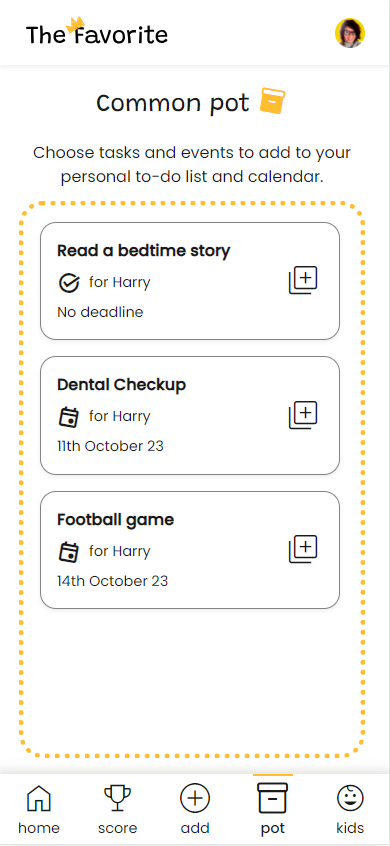
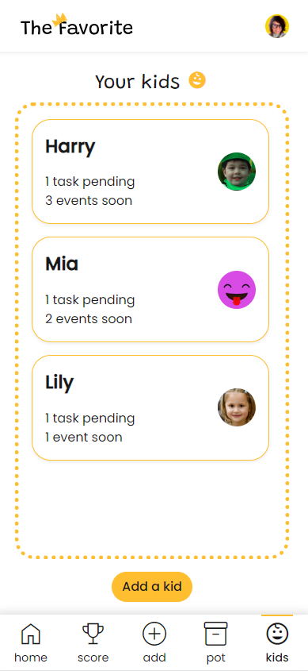

> Yes, kids have their favorite parent too. Are you sure it’s you?

Final project of the LeWagon bootcamp by [Tanya Lathion](https://github.com/tanyalathion "Tanya's github profile"), [Veronique Hagen](https://github.com/veroniquehagen "Veronique's github profile") and [Maxime Hmae](https://github.com/max13h "Maxime's github profile")

## Project pitch
The mental load is doubled when it's shared with the other parents and relationships deteriorate due to the tensions created by the organization.

**The Favorite** offers a humorous take on the burden of parenthood. Parents work as a real team, while having fun competing against each other.
## Screenshots

  
  
  
  
  
  

